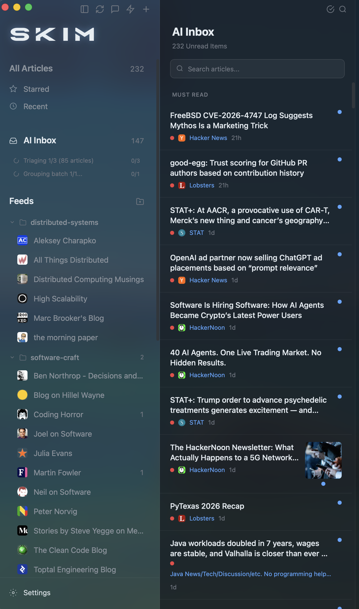
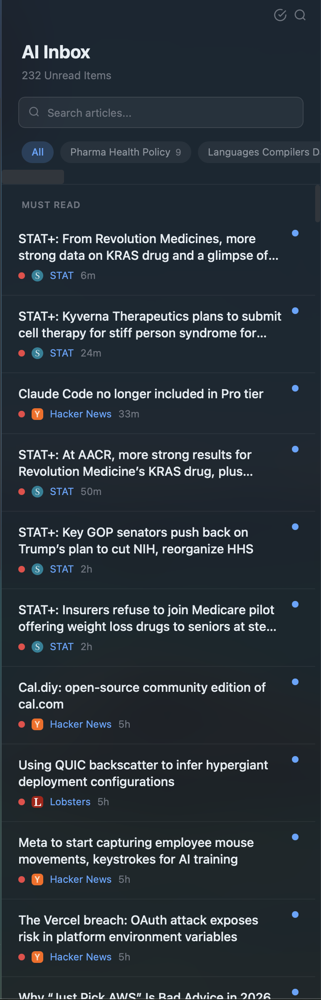
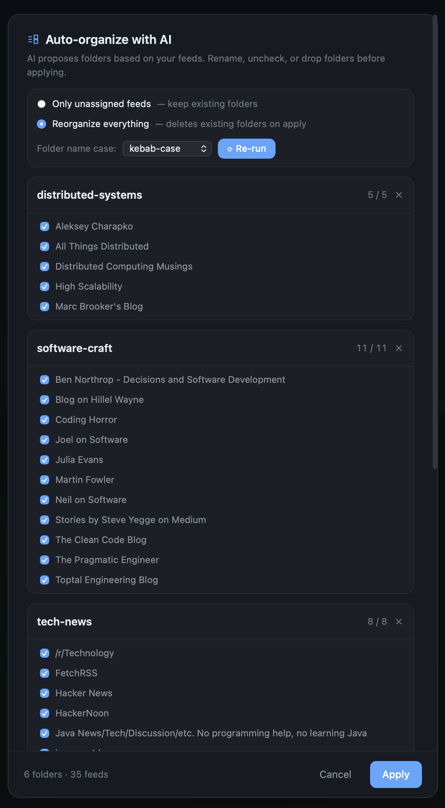
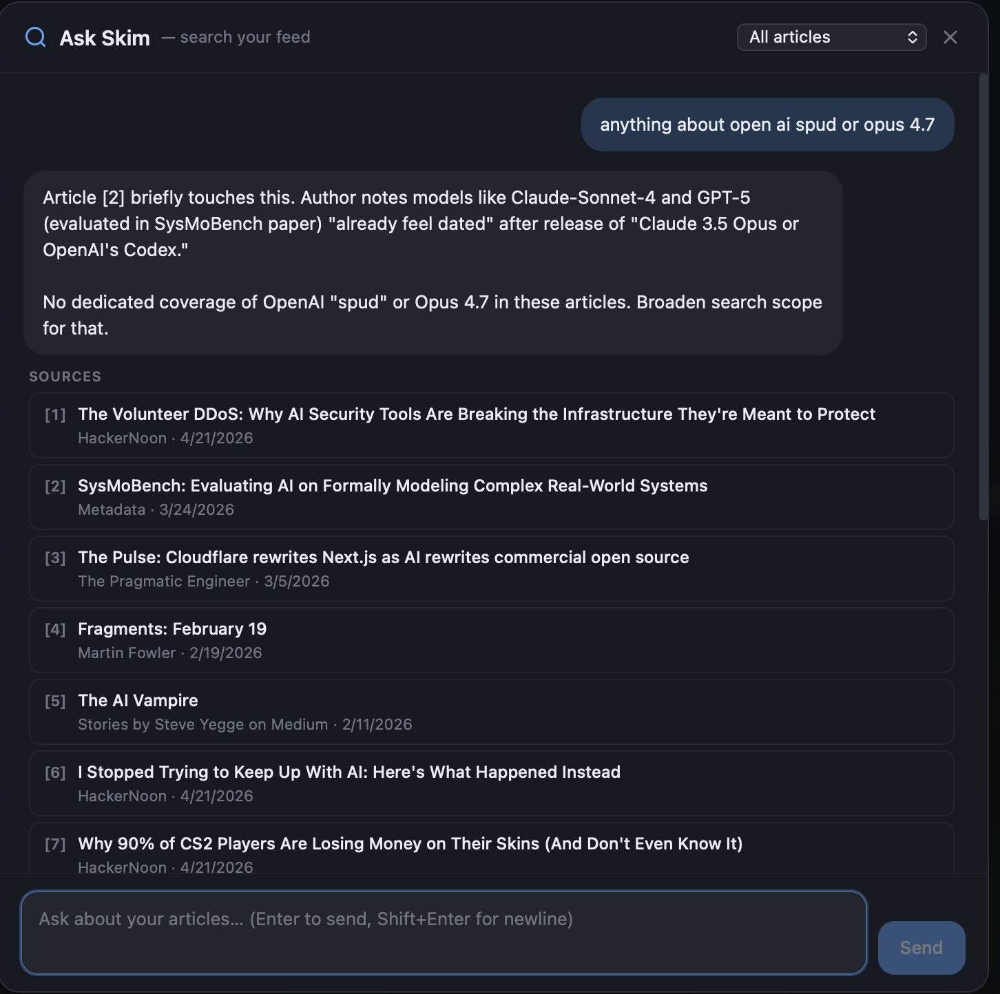
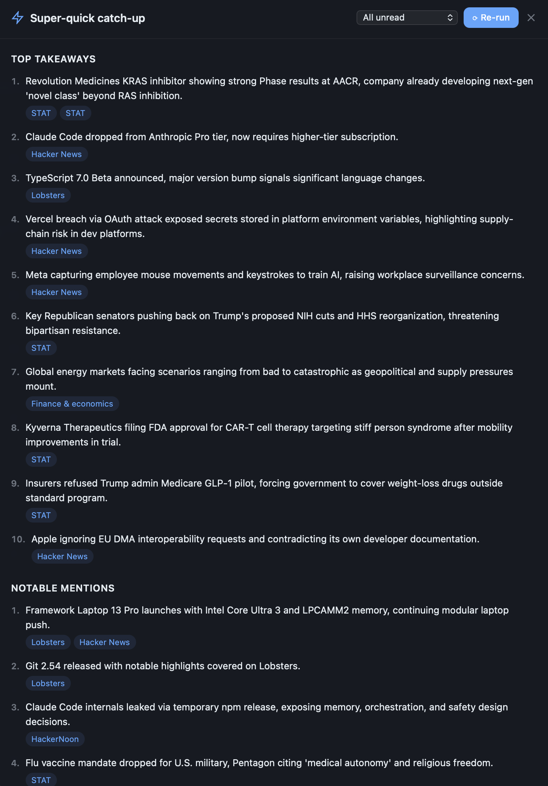
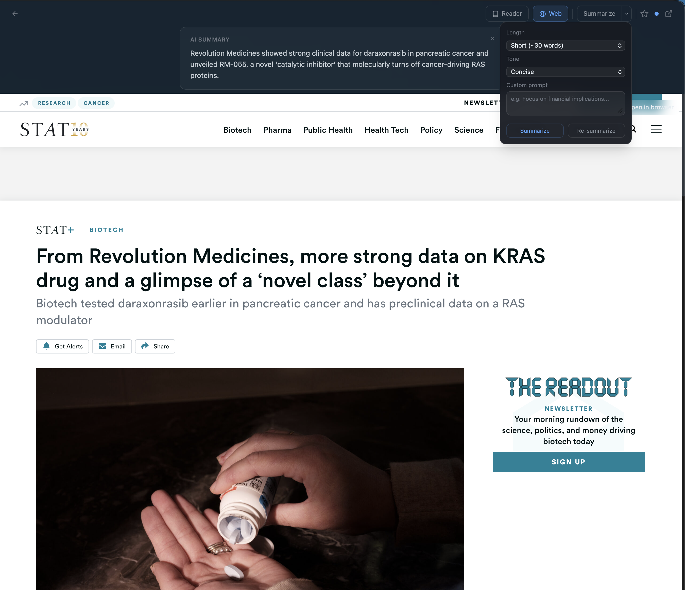

# Skim

**RSS reader for the age of AI.** Ingest feeds, let a model triage the noise, skim the rest.

<p align="center">
  
</p>

Desktop (macOS / Windows / Linux) via [Tauri 2](https://tauri.app). iOS / iPadOS in progress.

---

## Features

| | |
|---|---|
| **Three-pane reader** | Sidebar · article list · detail. Favicons, unread counts, keyboard nav. |
| **AI Inbox** | Every unread scored 1–5 with a one-line reason. `MUST READ` floats; `SKIP` sinks. |
| **Learns from you** | Reading time, stars, chats, feedback, overrides — all feed triage. Plus a freeform *"what I care about"* prompt. |
| **Auto-organize** | AI proposes folders from your feeds. Edit, then apply. |
| **Ask Skim** | Chat across your whole feed with citations. `web_search` tool available. |
| **Super-quick catch-up** | Ten takeaways + notable mentions across unread. |
| **Summarize** | Length, tone, format, custom prompt per article. |
| **Per-article chat** | Grounded on the article; `web_search` tool available. |
| **Smart folders** | Regex on title / URL / OPML category. Any/all match modes. |
| **Feedly + OPML** | Full two-way Feedly sync. Import / export OPML. |
| **Local-first** | All data in SQLite. No Skim cloud. |
| **On-device AI** | llama.cpp (desktop) · MLX (iOS) · Apple Foundation Models (iOS 26+). |
| **Claude subscription** | OAuth sign-in — no API key, uses your Pro/Max. |

---

## Screenshots

<table>
  <tr>
    <td align="center" width="33%">
      <a href="docs/screenshots/02-ai-inbox-themes.png"></a><br/>
      <sub><b>AI Inbox</b> — priority + theme chips</sub>
    </td>
    <td align="center" width="33%">
      <a href="docs/screenshots/03-auto-organize.png"></a><br/>
      <sub><b>Auto-organize</b> — AI-proposed folders</sub>
    </td>
    <td align="center" width="33%">
      <a href="docs/screenshots/04-ask-skim.png"></a><br/>
      <sub><b>Ask Skim</b> — chat + citations + web</sub>
    </td>
  </tr>
  <tr>
    <td align="center" width="33%">
      <a href="docs/screenshots/05-catchup.png"></a><br/>
      <sub><b>Catch-up</b> — ten takeaways</sub>
    </td>
    <td align="center" width="33%">
      <a href="docs/screenshots/06-summarize.png"></a><br/>
      <sub><b>Summarize</b> — length · tone · custom prompt</sub>
    </td>
    <td align="center" width="33%">
      <a href="docs/screenshots/01-main-view.png"></a><br/>
      <sub><b>Main view</b> — three-pane reader</sub>
    </td>
  </tr>
</table>

Click any thumbnail for the full image.

---

## AI providers

<details>
<summary>Pick per-task or default. Subscription OAuth is the smoothest if you have Claude Pro/Max.</summary>

| Provider | Auth |
|---|---|
| **Claude Pro/Max** | OAuth sign-in with claude.ai. No API key. |
| Claude (API key) | `sk-ant-…` |
| Claude CLI (legacy) | Delegates to local `claude -p` |
| OpenAI | API key |
| OpenRouter | API key |
| Ollama | Local LAN (default `localhost:11434`) |
| Custom | Any OpenAI-compatible endpoint |
| Local (llama.cpp) | Embedded, desktop only, Metal acceleration |
| **MLX (iOS)** | Qwen 2.5 3B default · Llama 3.2 3B · Phi-3.5 Mini |
| **Apple Foundation Models** | iOS 26+, Apple-managed, no download |

</details>

---

## Dev setup

```bash
pnpm install
pnpm tauri dev           # desktop
pnpm tauri build         # production
```

Requires Rust 1.94+ and Node 20+. iOS additionally needs `Xcode.app`, `cargo install tauri-cli --version "^2.0.0"`, and `brew install cocoapods`.

See [`docs/SPEC.md`](docs/SPEC.md) for the full feature spec and architecture notes.

---

## License

[MIT](LICENSE).
