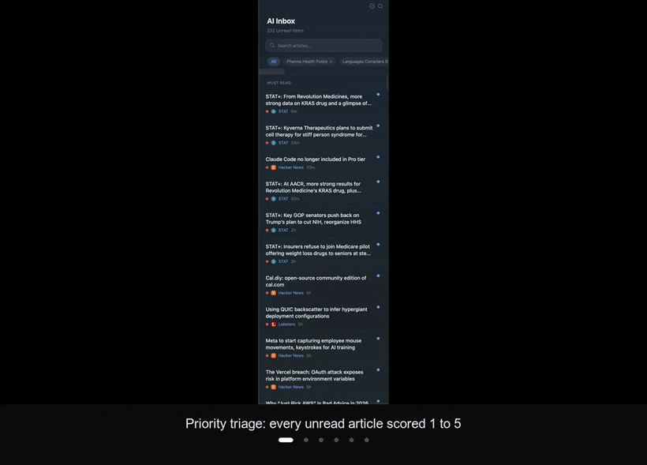

# Skim

**RSS reader for the age of AI.** Ingest feeds. Let a model triage the noise. Skim the rest.

<p align="center">
  
</p>

---

## Install

```bash
pnpm install
pnpm tauri dev
```

Desktop via [Tauri 2](https://tauri.app). macOS / Windows / Linux. iOS / iPadOS in progress.

Full feature list and architecture in [`docs/SPEC.md`](docs/SPEC.md).

[MIT](LICENSE).
